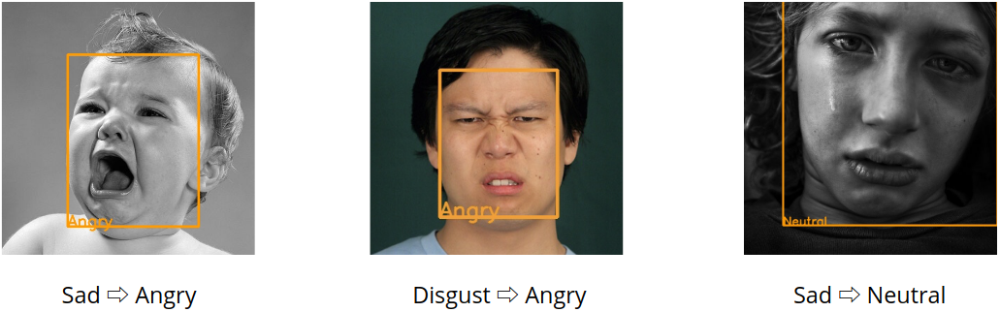

# AI_TeamProject
충남대학교 인공지능 강의 팀 프로젝트 - Convolutional Neural Network를 이용한 감정 분류 기법
- 201402453 황동준
- 201402368 심규영
- 201502045 김현지
---
### Data-set 구성
- 사람의 감정 분류 이미지 데이터로 Kaggle에서 제공하는 [FER2013](https://www.kaggle.com/deadskull7/fer2013)사용
    - 48 X 48 흑백 이미지
    - 문제점:
        1. Misclassification 된 이미지들이 많음
        2. Class Imbalance 문제가 있음
    - 개선점:
        1. Misclassification에 대한 Relabelling 작업 수행

            - deleted를 제외한 이미지는 Relabelling전 이미지 → **현재 Relabelling 완료**
        2. Class Imbalance에 대한 Data Augmentation 작업 수행

            - Disgust 이미지 관련해서 Data augmentation 수행 (옵션은 랜덤으로 아래와 같이 6가지 수행)
                - rotation_range=20
                - width_shift_range=0.1
                - height_shift_range=0.1 
                - horizontal_flip=True
                - brightness_range=[0.5,1.0]
                - fill_mode='nearest'
            - 나머지 이미지의 개수는 Relabelling과정에서 delete 또는 add됨
---
### 학습 구조
1. Face Recognition (얼굴 인식 기법)
2. Face Alignment (얼굴 정렬 기법)
3. Emotion Classification (감정 분류 기법)
---
### Face Recognition (얼굴 인식 기법)
- 우리는 Face Detection과 Landmark를 동시 검출하는 알고리즘인 [MTCNN](https://github.com/ipazc/mtcnn)(Multi-task Cascaded Convolutional Neural Networks)을 사용하여 Face Recognition을 수행

- MTCNN을 통해 양쪽 눈, 코, 입꼬리에 대한 좌표를 추출하여 Face Alignment에 이용
---
### Face Alignment (얼굴 정렬 기법)

1. MTCNN 사용하여 이미지의 landmark를 확인 ( 양쪽 눈 중앙, 코, 입꼬리 )
2. 양쪽 눈의 좌표를 잇는 선 확인
3. 수평선과 평행을 이루도록 이미지를 회전 ( 수평선과의 각도를 arctan을 통해 구한다. )
4. 분류에 필요한 이미지를 얻기 위한 크기 조절
---
### Emotion Classification (감정 분류 기법)

- Filter의 크기는 3 × 3이며, Stride는 1로 이동
- Convolution Layer 2개당  Max Pooling을 수행
- Zero Padding, Batch Normalization, Dropout, Learning rate decay 방법 사용

- Dropout기법을 사용한 model과 사용하지 않은 model을 학습
    - Dropout기법을 사용하지 않은 model에서 Overfitting 현상 확인
    - Dropout기법을 사용한 model을 선택
---
### 테스트 절차

1. Input Image에 대해 MTCNN을 사용한 얼굴 인식 후, 얼굴 정렬을 실행
2. 1번 RGB 결과 Image를 48x48 Gray scale image로 변환
3. 2번 결과 Image를 감정 분류 모델을 통해 분류

---
### 감정 분류 결과
- 결과 정확도는 54%
#### 성공 예시

#### 실패 예시

